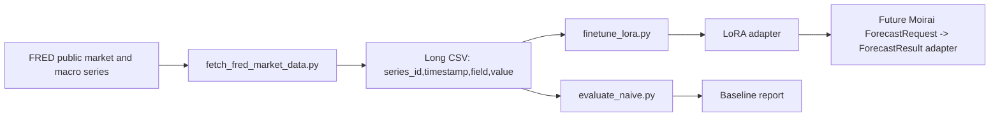

# TimesFM 2.5 LoRA Domain Adaptation

Goal: fine-tune TimesFM 2.5 with LoRA so Time0 can produce a domain-specialized
forecasting adapter for Moirai-compatible time-series work.

First domain: public market and macro risk forecasting.

The first adapter is deliberately not a buy/sell signal model. Directional
returns are noisy and easy to overfit. Volatility and risk series are more
stable, easier to evaluate, and more useful as inputs to downstream Moirai
forecast/risk Modules.

## Architecture



## Epistemic Split

Fact: LoRA freezes the base model and trains a small adapter.

Assumption: the first Time0 domain adapter should target market volatility/risk
because it has clearer signal than one-step price direction.

Inference: if the LoRA adapter cannot beat last-value and seasonal naive
baselines on rolling windows, it should not be integrated into Moirai.

Recommendation: treat every adapter as an experiment artifact until rolling
backtests prove it is better than TimesFM zero-shot and naive baselines.

## Success Criteria

Training completion is not success. This experiment uses explicit stop,
success, and promotion gates:

```text
experiments/timesfm-lora/SUCCESS_CRITERIA.md
```

Project-level stop, maintenance, and publication strategy:

```text
experiments/timesfm-lora/PROJECT_STRATEGY.md
```

Current verdict:

```text
level LoRA: failed candidate success; stop increasing steps for this target.
log_change LoRA: partial signal; MAE improved slightly, SMAPE regressed.
realized_vol_20 LoRA: positive rolling signal, but not promotion-ready.
```

## Data Contract

Training CSV must be long format:

```csv
series_id,timestamp,field,value,source_symbol,source
VIXCLS:level,2025-01-02,level,17.93,VIXCLS,fred
```

Required columns:

```text
series_id: stable time-series identifier
timestamp: sortable timestamp or date
field: target name, for example realized_vol_20 or log_return
value: numeric target
```

## First Real Run

```bash
uv sync
uv run python scripts/patch_transformers_fast_import.py
uv run python scripts/fetch_fred_market_data.py \
  --series-file data/seeds/fred_series.txt \
  --output data/market/daily_market_series.csv \
  --start 2010-01-01

uv run python scripts/evaluate_naive.py \
  --csv data/market/daily_market_series.csv \
  --field level \
  --context-len 128 \
  --horizon-len 20 \
  --max-windows 500 \
  --skip-windows 5000 \
  --output reports/naive-market-macro-level-h20.json

uv run python scripts/finetune_lora.py \
  --csv data/market/daily_market_series.csv \
  --field level \
  --context-len 128 \
  --horizon-len 20 \
  --max-windows 5000 \
  --skip-windows 0 \
  --batch-size 2 \
  --max-steps 1000 \
  --lora-r 4 \
  --lora-alpha 8 \
  --output-dir adapters/market-macro-level-h20-r4

uv run python scripts/evaluate_timesfm.py \
  --csv data/market/daily_market_series.csv \
  --field level \
  --model-id .hf-cache/timesfm-2.5-200m-transformers \
  --context-len 128 \
  --horizon-len 20 \
  --max-windows 500 \
  --skip-windows 5000 \
  --output reports/timesfm-zero-shot-market-macro-level-h20.json

uv run python scripts/evaluate_timesfm.py \
  --csv data/market/daily_market_series.csv \
  --field level \
  --model-id .hf-cache/timesfm-2.5-200m-transformers \
  --adapter-dir adapters/market-macro-level-h20-r4 \
  --context-len 128 \
  --horizon-len 20 \
  --max-windows 500 \
  --skip-windows 5000 \
  --output reports/timesfm-lora-market-macro-level-h20-r4.json
```

## Learning While Operating

Each run should change one lever only:

```text
lora-r: adapter capacity
lora-alpha: adapter update scale
learning-rate: optimizer step size
context-len: history window
horizon-len: prediction window
target field: what behavior the adapter specializes in
```

The first useful comparison is:

```text
base: last-value naive
adapter A: market-macro-level-h20-r4
adapter B: market-macro-level-h20-r8
```

After that, add TimesFM 2.5 zero-shot evaluation and only keep LoRA adapters
that improve rolling backtest metrics.
