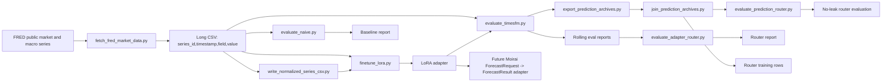

# TimesFM 2.5 LoRA Domain Adaptation

Goal: fine-tune TimesFM 2.5 with LoRA so Time0 can produce a domain-specialized
forecasting adapter for Moirai-compatible time-series work.

First domain: public market and macro risk forecasting.

The first adapter is deliberately not a buy/sell signal model. Directional
returns are noisy and easy to overfit. Volatility and risk series are more
stable, easier to evaluate, and more useful as inputs to downstream Moirai
forecast/risk Modules.

Current target direction:

```text
domain: financial market / macro risk
data: FRED public daily market and macro series
target: realized_vol_20
meaning: 20-day realized volatility derived from daily log changes
```

## Architecture



## Epistemic Split

Fact: LoRA freezes the base model and trains a small adapter.

Assumption: the first Time0 domain adapter should target market volatility/risk
because it has clearer signal than one-step price direction.

Inference: if the LoRA adapter cannot beat last-value and seasonal naive
baselines on rolling windows, it should not be integrated into Moirai.

Recommendation: treat every adapter as an experiment artifact until rolling
backtests prove it is better than TimesFM zero-shot and naive baselines.

## Success Criteria

Training completion is not success. This experiment uses explicit stop,
success, and promotion gates:

```text
experiments/timesfm-lora/SUCCESS_CRITERIA.md
```

Project-level stop, maintenance, and publication strategy:

```text
experiments/timesfm-lora/PROJECT_STRATEGY.md
```

Current verdict:

```text
level LoRA: failed candidate success; stop increasing steps for this target.
log_change LoRA: partial signal; MAE improved slightly, SMAPE regressed.
realized_vol_20 LoRA: positive rolling signal, but cut5500 distribution shift blocks promotion.
normalized realized_vol_20 LoRA: diagnostic useful, but failed to fix cut5500.
recent2000 realized_vol_20 LoRA: improved cut5500, but average gain remains below promotion.
recent3000 realized_vol_20 LoRA: negative result; improved cut4000 but weakened cut5500 repair.
recent1500 realized_vol_20 LoRA: fixed-window route failed; best window is split-dependent.
historical adapter router: no-leak baseline failed; leaky oracle shows selection upside.
prediction archive: evaluation interface now records per-window features, predictions, and actuals.
full archive export: 15 aligned archives and 7500 records are available locally for joiner work.
router rows: 1500 no-leak checked rows are available locally; leaky per-window oracle reaches 5.95% MAE headroom.
prediction router: learned no-leak router did not beat fixed recent2000; validation-gated policy correctly stayed on fallback.
expanded rolling grid: 4500 router rows across 9 cuts; validation-gated routing reaches 2.116398% routed MAE gain, but only adds 0.131419% relative lift over fixed recent2000 fallback.
router attribution: validation-gated lift is concentrated; DFF contributes 148.703165% of net delta while DGS10 and SP500 regress vs fallback.
series-aware router guard: best tested guard uses 0.0% per-series lift, improves routed MAE delta over fallback to 0.0002025053, but still blocks publication.
multi-cut series guard: aggregate multi-cut does not improve; worst-cut improves over validation-gated but over-blocks DFF, so best policy remains series_guarded 0.0%.
recency-weighted series risk: decay 0.1 ties the best series_guarded result and confirms recent validation must dominate older cut evidence.
early rolling grid: adds cuts 3000/3250 and 5500 rows, but fail-closed learned routing underperforms fixed recent2000; next step is richer no-leak runtime features.
no-leak regime features: first positive MAE validation-gated router on early grid; SMAPE and series guards still block promotion.
feature ablation: best no-leak surface is alignment-normalized; MAE, SMAPE, and series-guarded MAE turn positive, but series lift remains too small for promotion.
policy sweep: series-risk tuning does not beat series_guarded; validation_gated 0.005 is the best risk-balanced candidate, but still not promotion-ready.
loss-aware selector: opt-in regret-softmax beats ordinary softmax but underperforms KNN-regret and lowers gated delta vs baseline; keep as diagnostic only.
```

## Data Contract

Training CSV must be long format:

```csv
series_id,timestamp,field,value,source_symbol,source
VIXCLS:level,2025-01-02,level,17.93,VIXCLS,fred
```

Required columns:

```text
series_id: stable time-series identifier
timestamp: sortable timestamp or date
field: target name, for example realized_vol_20 or log_return
value: numeric target
```

## First Real Run

```bash
uv sync
uv run python scripts/patch_transformers_fast_import.py
uv run python scripts/fetch_fred_market_data.py \
  --series-file data/seeds/fred_series.txt \
  --output data/market/daily_market_series.csv \
  --start 2010-01-01

uv run python scripts/evaluate_naive.py \
  --csv data/market/daily_market_series.csv \
  --field level \
  --context-len 128 \
  --horizon-len 20 \
  --max-windows 500 \
  --skip-windows 5000 \
  --output reports/naive-market-macro-level-h20.json

uv run python scripts/finetune_lora.py \
  --csv data/market/daily_market_series.csv \
  --field level \
  --context-len 128 \
  --horizon-len 20 \
  --max-windows 5000 \
  --skip-windows 0 \
  --batch-size 2 \
  --max-steps 1000 \
  --lora-r 4 \
  --lora-alpha 8 \
  --output-dir adapters/market-macro-level-h20-r4

uv run python scripts/evaluate_timesfm.py \
  --csv data/market/daily_market_series.csv \
  --field level \
  --model-id .hf-cache/timesfm-2.5-200m-transformers \
  --context-len 128 \
  --horizon-len 20 \
  --max-windows 500 \
  --skip-windows 5000 \
  --output reports/timesfm-zero-shot-market-macro-level-h20.json

uv run python scripts/evaluate_timesfm.py \
  --csv data/market/daily_market_series.csv \
  --field level \
  --model-id .hf-cache/timesfm-2.5-200m-transformers \
  --adapter-dir adapters/market-macro-level-h20-r4 \
  --context-len 128 \
  --horizon-len 20 \
  --max-windows 500 \
  --skip-windows 5000 \
  --output reports/timesfm-lora-market-macro-level-h20-r4.json
```

Optional prediction archive for router work:

```bash
uv run python scripts/evaluate_timesfm.py \
  --csv data/market/daily_market_series.csv \
  --field realized_vol_20 \
  --model-id .hf-cache/timesfm-2.5-200m-transformers \
  --adapter-dir adapters/market-macro-realized-vol-20-h20-r4-step200-recent2000-train5500 \
  --context-len 128 \
  --horizon-len 20 \
  --max-windows 500 \
  --skip-windows 5500 \
  --output reports/timesfm-lora-market-macro-realized-vol-20-h20-r4-step200-recent2000-train5500-holdout500-skip5500.json \
  --predictions-output reports/predictions-timesfm-lora-market-macro-realized-vol-20-h20-r4-step200-recent2000-train5500-holdout500-skip5500.json
```

Full router archive export:

```bash
uv run python scripts/export_prediction_archives.py
```

Router row join:

```bash
uv run python scripts/join_prediction_archives.py \
  --output reports/router-rows-market-macro-realized-vol-20-h20-r4.json
```

No-leak prediction router evaluation:

```bash
uv run python scripts/evaluate_prediction_router.py \
  --input reports/router-rows-market-macro-realized-vol-20-h20-r4.json \
  --output reports/no-leak-prediction-router-market-macro-realized-vol-20-h20-r4.json
```

Expanded rolling grid:

```bash
uv run python scripts/train_rolling_grid_adapters.py --grid expanded

uv run python scripts/export_prediction_archives.py --grid expanded

uv run python scripts/join_prediction_archives.py \
  --grid expanded \
  --output reports/router-rows-expanded-market-macro-realized-vol-20-h20-r4.json

uv run python scripts/evaluate_prediction_router.py \
  --input reports/router-rows-expanded-market-macro-realized-vol-20-h20-r4.json \
  --output reports/no-leak-prediction-router-expanded-market-macro-realized-vol-20-h20-r4.json
```

Early rolling grid:

```bash
uv run python scripts/train_rolling_grid_adapters.py \
  --grid early \
  --cut 3000 \
  --cut 3250

uv run python scripts/export_prediction_archives.py \
  --grid early \
  --cut 3000 \
  --cut 3250

uv run python scripts/join_prediction_archives.py \
  --grid early \
  --output reports/router-rows-early-market-macro-realized-vol-20-h20-r4.json
```

Early grid with regime features:

```bash
uv run python scripts/join_prediction_archives.py \
  --grid early \
  --output reports/router-rows-early-regime-market-macro-realized-vol-20-h20-r4.json

uv run python scripts/evaluate_prediction_router.py \
  --input reports/router-rows-early-regime-market-macro-realized-vol-20-h20-r4.json \
  --output reports/no-leak-prediction-router-early-regime-market-macro-realized-vol-20-h20-r4.json
```

Feature ablation:

```bash
uv run python scripts/ablate_router_features.py \
  --preset alignment-normalized \
  --input reports/router-rows-early-regime-market-macro-realized-vol-20-h20-r4.json \
  --output reports/router-rows-early-regime-ablate-alignment-normalized-market-macro-realized-vol-20-h20-r4.json

uv run python scripts/evaluate_prediction_router.py \
  --input reports/router-rows-early-regime-ablate-alignment-normalized-market-macro-realized-vol-20-h20-r4.json \
  --output reports/no-leak-prediction-router-early-regime-ablate-alignment-normalized-market-macro-realized-vol-20-h20-r4.json
```

Policy sweep:

```bash
uv run python scripts/sweep_router_policies.py \
  --input reports/router-rows-early-regime-ablate-alignment-normalized-market-macro-realized-vol-20-h20-r4.json \
  --output reports/router-policy-sweep-alignment-normalized-market-macro-realized-vol-20-h20-r4.json \
  --policy validation_gated \
  --policy series_guarded \
  --policy series_risk_penalized \
  --min-validation-lift 0 \
  --min-validation-lift 0.005 \
  --min-validation-lift 0.01 \
  --min-series-validation-lift 0 \
  --min-series-validation-lift 0.001 \
  --series-risk-decay 0.05 \
  --series-risk-decay 0.1 \
  --series-risk-decay 0.25
```

Loss-aware selector:

```bash
uv run python scripts/evaluate_prediction_router.py \
  --candidate-set loss-aware \
  --input reports/router-rows-early-regime-ablate-alignment-normalized-market-macro-realized-vol-20-h20-r4.json \
  --output reports/no-leak-prediction-router-early-regime-ablate-alignment-normalized-loss-aware-market-macro-realized-vol-20-h20-r4.json
```

Router attribution:

```bash
uv run python scripts/summarize_router_attribution.py \
  --input reports/router-rows-expanded-market-macro-realized-vol-20-h20-r4.json \
  --output reports/router-attribution-expanded-market-macro-realized-vol-20-h20-r4.json
```

Series-aware router guard:

```bash
uv run python scripts/summarize_router_attribution.py \
  --policy series_guarded \
  --input reports/router-rows-expanded-market-macro-realized-vol-20-h20-r4.json \
  --output reports/router-attribution-series-guarded-expanded-market-macro-realized-vol-20-h20-r4.json
```

Multi-cut series guard:

```bash
uv run python scripts/summarize_router_attribution.py \
  --policy series_multicut_worst_guarded \
  --input reports/router-rows-expanded-market-macro-realized-vol-20-h20-r4.json \
  --output reports/router-attribution-series-multicut-worst-guarded-expanded-market-macro-realized-vol-20-h20-r4.json
```

Recency-weighted series risk:

```bash
uv run python scripts/summarize_router_attribution.py \
  --policy series_risk_penalized \
  --input reports/router-rows-expanded-market-macro-realized-vol-20-h20-r4.json \
  --output reports/router-attribution-series-risk-penalized-expanded-market-macro-realized-vol-20-h20-r4.json
```

Selected dry run:

```bash
uv run python scripts/export_prediction_archives.py \
  --dry-run \
  --cut 4000 \
  --family zero-shot \
  --family recent2000
```

## Learning While Operating

Each run should change one lever only:

```text
lora-r: adapter capacity
lora-alpha: adapter update scale
learning-rate: optimizer step size
context-len: history window
horizon-len: prediction window
target field: what behavior the adapter specializes in
```

The first useful comparison is:

```text
base: last-value naive
adapter A: market-macro-level-h20-r4
adapter B: market-macro-level-h20-r8
```

After that, add TimesFM 2.5 zero-shot evaluation and only keep LoRA adapters
that improve rolling backtest metrics.
